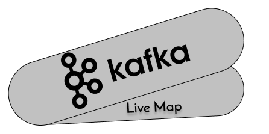

<h1 align="center">
      
</h1>

<h3 align="center">
  Kafka Live Map
</h3>

This is a simple aplication to test a messagem broker with coordinates and map 👨‍💻

Made with Python 🚀

Using PyKafka 🚀

  

  

  <a href="#-demonstration">Demonstration</a>&nbsp;&nbsp;&nbsp;|&nbsp;&nbsp;&nbsp;
  <a href="#-available-routes">Available Routes</a>&nbsp;&nbsp;&nbsp;|&nbsp;&nbsp;&nbsp;
  <a href="#-how-to-contribute">How to contribute</a>&nbsp;&nbsp;&nbsp;|&nbsp;&nbsp;&nbsp;

## 🎉 Demonstration

## 🛣️ Available Routes

- '/' - Index with the map and live location.

## 🤔 How to contribute

- Fork this repository;
- Create a branch with your feature: `git checkout -b my-feature`;
- Commit your changes: `git commit -m 'feat: My new feature'`;
- Push to your branch: `git push origin my-feature`.

After the merge of your pull request is done, you can delete your branch.

---

